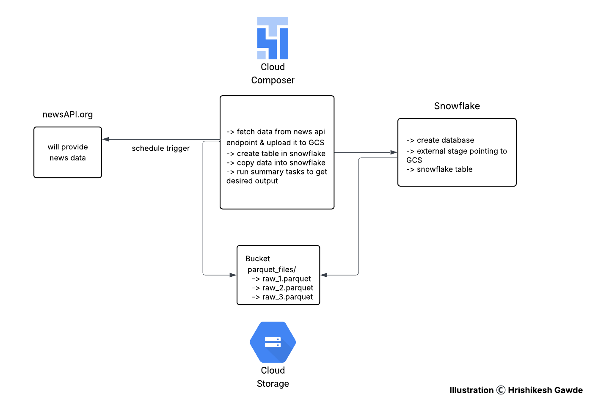

# News Data Analysis with Event Driven Incremental Load in Snowflake

## Introduction
This project focuses on building a news data analytics pipeline with an event-driven incremental load strategy into a Snowflake table. It showcases how to extract data from an API endpoint, store raw files in Google Cloud Storage (GCS), and then incrementally load and process that data in Snowflake using Airflow orchestration.

## Problem Statement
Traditional batch data loads often reprocess the entire dataset, leading to inefficiencies. This project addresses the need for an incremental, event-driven ingestion and transformation pipeline that consumes external API data (news articles), stages it in GCS, and incrementally loads it into Snowflake for downstream analytics.

## Architecture
The architecture follows a scheduled event-driven pattern where Airflow (Cloud Composer) orchestrates API extraction, GCS storage, Snowflake staging, and data transformation.

## Technology Used
- Python
- Apache Airflow (Cloud Composer)
- Google Cloud Storage (GCS)
- Snowflake
- Pandas

## Dataset Used
Data was fetched dynamically from the newsAPI.org API endpoint. There was no static dataset used. API endpoint returns data that contains list of articels related to a keyword in which each item in list is a json object representing an article with fields like source.id, source.name, author, title, description, url, urlToImage, content, publishedAt,

## Scripts for Project
#### fetch_news.py:
Contains two main functions:
- upload_to_gcs: Uploads extracted Parquet files to Google Cloud Storage.
- fetch_news_data: Fetches news articles for a specified keyword and date from NewsAPI.org, transforms them into a Pandas DataFrame, and saves them as a Parquet file in GCS.

#### news_api_airflow_job.py:
Airflow DAG file that defines the following tasks:
- Fetch API Data: Uses PythonOperator to run fetch_news_data() and upload new data to GCS.
- Create Snowflake Table: Uses SnowflakeOperator to create the target table in Snowflake by inferring the schema from GCS external stage Parquet files.
- Copy Data into Snowflake (Incremental Load): Uses SnowflakeOperator with a COPY INTO SQL command to load only new Parquet files from the GCS external stage to the target Snowflake table.
- Summary Tasks in Snowflake:
  - news_summary_task: Generates a summary table grouping article counts by news source, along with the earliest and latest article timestamps.
  - author_activity_task: Creates a table showing each author's activity, including the number of articles, distinct sources they contributed to, and their latest article date.

#### snowflake_commands.sql:
SQL scripts to set up Snowflake objects like:
- Database 
- Storage integration
- External stage pointing to GCS

## Output and Impact
- Successfully implemented event-driven incremental loading into a Snowflake table using the COPY INTO command from an external stage.
- Enabled automated daily ingestion and summarization of news articles from the NewsAPI.org endpoint.
- Created two business summary tables in Snowflake for downstream analysis:
  - summary_news: Article count and publication range per news source.
  - author_activity: Author-wise publishing activity metrics.
- This pipeline ensures Snowflake only loads newly arrived Parquet files in GCS, making the ETL process cost-efficient and scalable.

## My Learnings
- Hands-on experience with event-driven incremental loads in Snowflake using external stages and the COPY INTO command.
- Building Airflow DAGs that integrate Python API calls with downstream data warehouse processing.
- Using Google Cloud Storage as an intermediate landing zone for Snowflake external stages.
- Working with external APIs (NewsAPI.org) for real-time data extraction.
- Data summarization and transformation using Snowflake SQL post ingestion.
